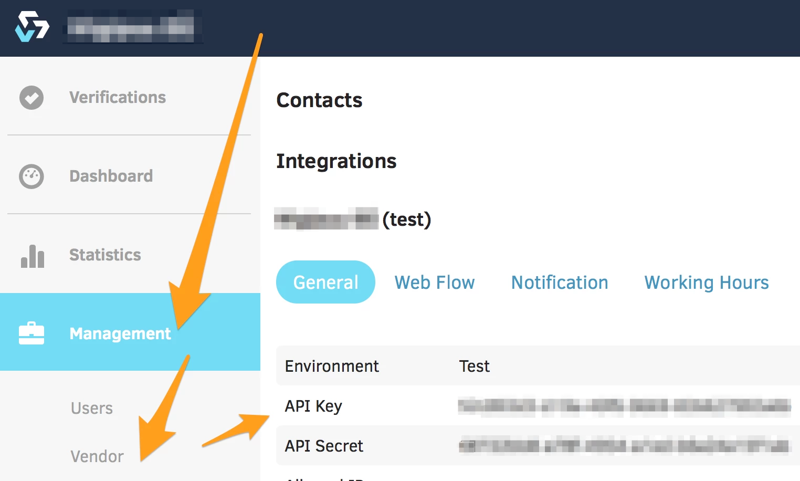

# Getting started with Veriff

# Signing up

Please take a minute and create your account at https://veriff.me/signup

You should then get an e-mail which explains how to create your password.

We use two factor authentication for logins.  You will need to download and install the Google Authenticator app on your mobile device. Please find it in the Apple App Store
http://appstore.com/googleauthenticator
or in the Google Play Store https://play.google.com/store/apps/details?id=com.google.android.apps.authenticator2

Once you have chosen your new password, you will set up Google Authenticator.  You'll see the QR code which is needed for the Google Authenticator while signing in the first time to the back office.

# How to find your API keys

Your API keys are stored in the Veriff back office, and can be found by logging in to https://office.veriff.me/

Choose Management in the sidebar, then Vendor, as follows:

Your initial API Key and API Secret are to be used for development and testing the test environment.

If you need multiple sets of API keys (for different platforms or environments), we can create more for you, just get in touch.

(For live use, we will create the live API keys once the development and testing has been completed)

# How to invite other users to your account

Once logged in to the Veriff back office, please go to Management / Users, and you will see a green New User button in the top right hand corner.  
You can fill “0” into the id code and phone number fields.

